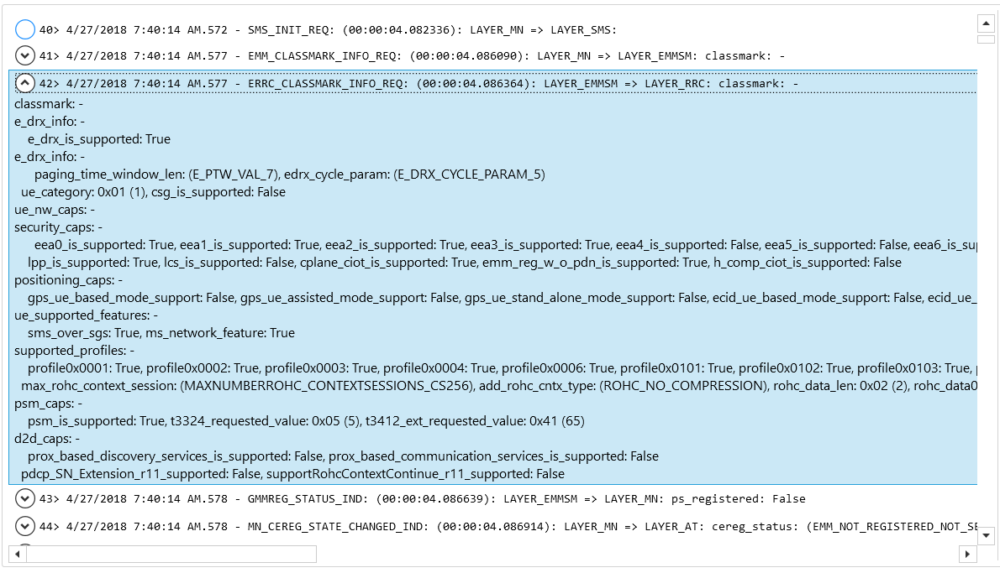
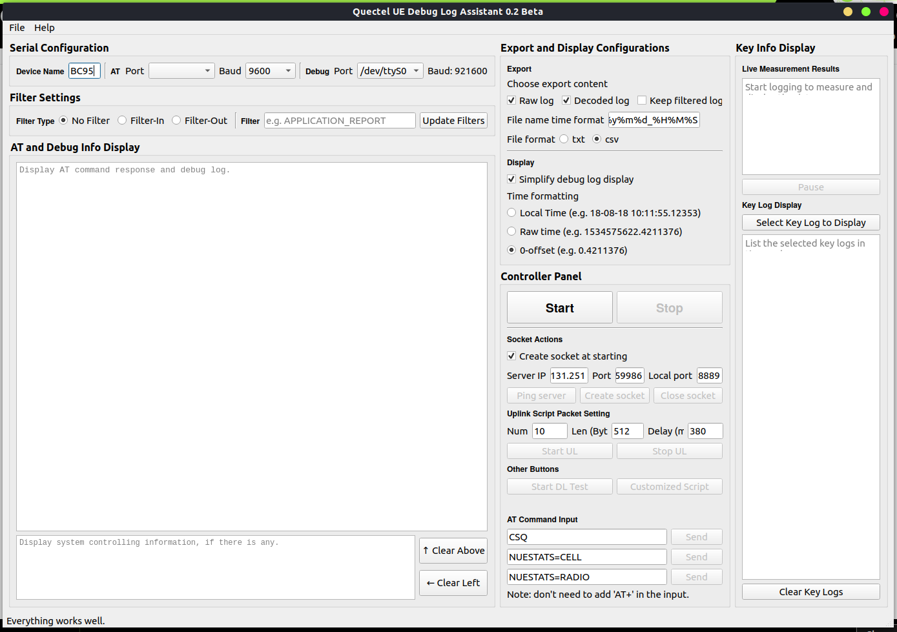
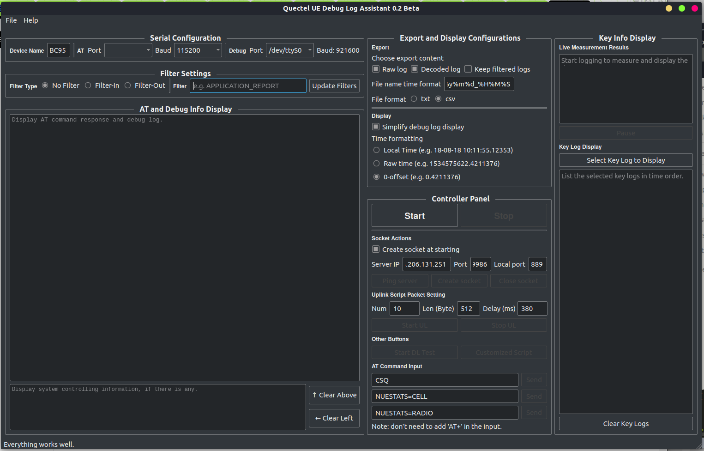
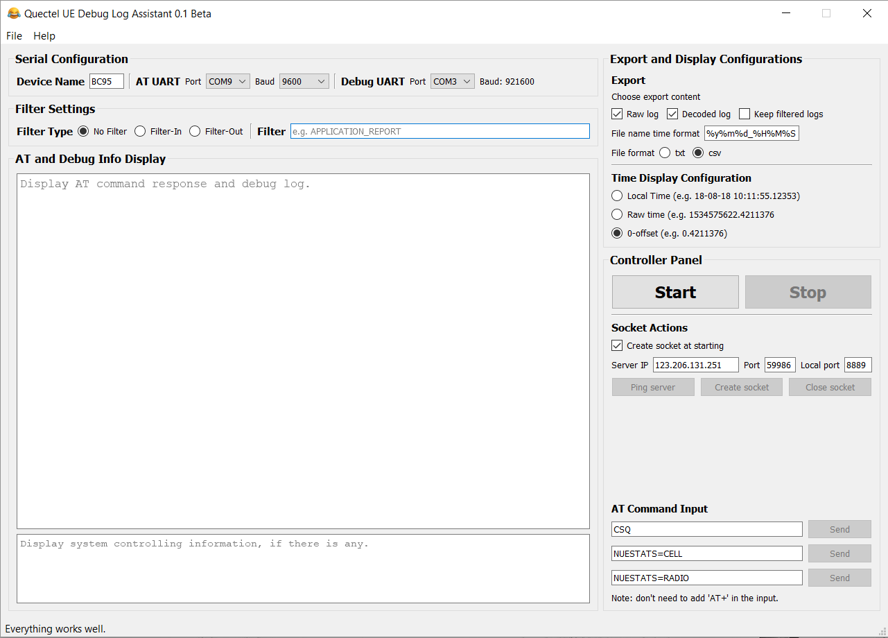

# About Quectel Debug Log Decoder

A decoder that leverages the message.xml file coming with the Quectel firmware to decode the UE (user equipment) debug log from the Quectel devices.

**[Important Note] I don't have much time to update the README.md. So the information below may be inconsistent with the code. I'll improve this document in the future.**

# Introduction

The program first finds the corresponding decoder `.xml`, then uses the message ID to build a dictionary, whose key is the message decoder node in the XML tree. Then for each message, the program will find the message ID and parse the fields contained in the data packet. 

The simplest way to get the log file is to use the **UE Log Viewer** provided in the `assets` folder. Windows only. 

So why don't we just use The Log Viewer to read the debug log? Well, IMHO the Log Viewer's user experience is bad. The first reason is the output format is ugly. It prints everything in a single line, which is hard to read. The second reason, the most important one, is that, you cannot search! It is so inconvenient for analysis. That's the motivation that I write this code snippet. 

# Features

- Currently, only [BC95](http://www.quectel.com/product/bc95.htm) and [BC28](https://www.quectel.com/cn/product/bc28.htm) debug log is supported. 
- Only the data recorded by UE Log Viewer is supported. 
- Save the decoded messages to files. 
- Support filter-out (remove redundant messages) and filter-in (only keep those cared messages).
- Easily change the output template. Revise `format_ordered_list()` function and `packet_output_formatting()` function accordingly.

# Limitations

- The UEs with HiSillicon chipset only (such as BC95 and BC28).
- The UEs with Qualcomm chipset should support QXDM by default (no other software needed).
- The display format is not quite friendly.

# Requirements

Prerequisite

``` sh
pip install PyQtWebEngine
pip install qdarkstyle
pip isntall Monsoon
```

Log your debug message with **UE Log Viewer**, provided in the `assets` folder. (If you use some other serial terminals to log, the output will be another story.)

Your log file should look like this:

> ;2018-04-27T19:40:14.0700318+08:00;7F-4F-36-00-01-00-00-00-00-00-A0-7F-00-00-19-00-65-63-68-6F-3A-30-2C-6B-65-79-3A-30-78-31-34-30-30-2C-76-61-6C-75-65-3A-30
> 
> ;2018-04-27T19:40:14.0750464+08:00;FF-E5-35-00-02-00-00-00-00-00-60-12-12-12-08-00-02-00-00-00-02-AD-02-21
> 
> ;2018-04-27T19:40:14.0750464+08:00;59-17-36-00-03-00-00-00-07-00-40-13-13-13-50-00-56-31-30-30-52-31-30-30-43-31-30-42-36-35-37-53-50-32-00-00-00-00-00-00-00-00-00-00-00-00-00-00-00-00-00-00-00-00-00-00-00-00-00-00-00-00-00-00-00-00-00-00-00-00-00-00-00-00-00-00-00-00-00-00-65-31-62-31-35-65-32-00-00-00-00-00-00-00-00-00
> 
> ;2018-04-27T19:40:14.0812779+08:00;E8-2F-36-00-04-00-00-00-00-00-60-17-17-12-28-00-42-43-39-35-48-42-2D-30-32-2D-53-54-44-5F-38-35-30-00-00-00-00-00-00-00-00-00-00-00-00-00-00-00-04-00-00-00-01-00-00-00
> 
> ;2018-04-27T19:40:14.0812779+08:00;62-30-36-00-05-00-00-00-02-00-60-17-17-12-68-00-0E-04-04-00-00-00-0E-04-BE-DE-D1-DD-12-00-42-43-39-35-48-42-2D-30-32-2D-53-54-44-5F-38-35-30-00-D2-DD-16-00-04-00-00-00-00-00-00-00-1F-00-08-00-01-00-0A-00-08-00-00-00-00-00-D3-DD-04-00-01-00-05-00-D4-DD-36-00-1A-00-00-00-01-00-00-00-00-00-00-00-00-00-00-00-02-00-03-00-03-00-02-00-03-00-03-00-01-00-01-00-00-00
> 
> ;2018-04-27T19:40:14.0821653+08:00;A1-35-36-00-06-00-00-00-01-00-60-1E-1E-12-20-00-01-05-FF-FF-FF-FF-FF-FF-FF-FF-FF-FF-FF-FF-FF-01-05-FF-FF-FF-FF-FF-FF-FF-FF-FF-FF-FF-FF-FF-01-00
> 

There are two ';' separating the timestamp and the data. The hex data is conncected using a hyphen '-'.

# Execution

- Command Line Interface (CLI)

``` sh
$ python debug_log_main.py
```

I didn't add the shebang to the main file. Yet I don't add any command argument input yet, since this is just a simple code snippet.

- Qt GUI version

``` sh
$ python qt_cmd_dbg_main.py
```

## Execution Output
> Message dict length: 836
> 
> Available types: 104
> 
> 1000 messages are processed.
> 
> 2000 messages are processed.
> 
> 3000 messages are processed.
> 
> 4000 messages are processed.
> 
> 5000 messages are processed.
> 
> 6000 messages are processed.
> 
> 7000 messages are processed.
> 
> 8000 messages are processed.
> 
> 9000 messages are processed.
> 
> 10000 messages are processed.
> 
> 11000 messages are processed.
> 
> 12000 messages are processed.
> 
> 13000 messages are processed.
> 
> 14000 messages are processed.
> 
> All messages are decoded.
> 
> Results have been write to file.
> 

## Example Decoded Message Output 

The first line is the header of the messasge, the elements are in the following order:

- Sequence ID (index), timestamp, message name (decimal message ID), source layer->destination layer, packet length.

> \#41	7:40:14.5779861		EMM_CLASSMARK_INFO_REQ(205520933)		MN -> EMMSM	60
> 
> classmark: 
> 
> 	e_drx_info: 
> 
> 		e_drx_is_supported: True
> 
> 		e_drx_info: 
> 
> 			paging_time_window_len: 7(E_PTW_VAL_7)
> 
> 			edrx_cycle_param: 5(E_DRX_CYCLE_PARAM_5)
> 
> 	ue_category: 1
> 
> 	csg_is_supported: False
> 
> 	ue_nw_caps: 
> 
> 		security_caps: 
> 
> 			eea0_is_supported: True
> 
> 			eea1_is_supported: True
> 
> 			eea2_is_supported: True
> 
> 			eea3_is_supported: True
> 
> 			eea4_is_supported: False
> 
> 			eea5_is_supported: False
> 
> 			eea6_is_supported: False
> 
> 			eea7_is_supported: False
> 
> 			eia0_is_supported: True
> 
> 			eia1_is_supported: True
> 
> 			eia2_is_supported: True
> 
> 			eia3_is_supported: True
> 
> 			eia4_is_supported: False
> 
> 			eia5_is_supported: False
> 
> 			eia6_is_supported: False
> 
> 			eia7_is_supported: False
> 
> 		lpp_is_supported: True
> 
> 		lcs_is_supported: False
> 
> 		cplane_ciot_is_supported: True
> 
> 		emm_reg_w_o_pdn_is_supported: True
> 
> 		h_comp_ciot_is_supported: False
> 
> 	positioning_caps: 
> 
> 		gps_ue_based_mode_support: False
> 
> 		gps_ue_assisted_mode_support: False
> 
> 		gps_ue_stand_alone_mode_support: False
> 
> 		ecid_ue_based_mode_support: False
> 
> 		ecid_ue_assisted_mode_support: False
> 
> 		otdoa_ue_based_mode_support: False
> 
> 		otdoa_ue_assisted_mode_support: False
> 
> 		glonass_ue_based_mode_support: False
> 
> 		glonass_ue_assisted_mode_support: False
> 
> 		glonass_ue_stand_alone_mode_support: False
> 
> 	ue_supported_features: 
> 
> 		sms_over_sgs: True
> 
> 		ms_network_feature: True
> 
> 	supported_profiles: 
> 
> 		profile0x0001: True
> 
> 		profile0x0002: True
> 
> 		profile0x0003: True
> 
> 		profile0x0004: True
> 
> 		profile0x0006: True
> 
> 		profile0x0101: True
> 
> 		profile0x0102: True
> 
> 		profile0x0103: True
> 
> 		profile0x0104: True
> 
> 	max_rohc_context_session: 10(MAXNUMBERROHC_CONTEXTSESSIONS_CS256)
> 
> 	add_rohc_cntx_type: 0(ROHC_NO_COMPRESSION)
> 
> 	rohc_data_len: 2
> 
> 	rohc_data_0: 0 / rohc_data_1: 0 / 
> 
> 	as_release_indicator: 2(ACCESSSTRATUMRELEASE_REL10)
> 
> 	psm_caps: 
> 
> 		psm_is_supported: True
> 
> 		t3324_requested_value: 5
> 
> 		t3412_ext_requested_value: 65
> 
> 	d2d_caps: 
> 
> 		prox_based_discovery_services_is_supported: False
> 
> 		prox_based_communication_services_is_supported: False
> 
> 	pdcp_SN_Extension_r11_supported: False
> 
> 	supportRohcContextContinue_r11_supported: False
> 

Check the `output_files` folder for the output files.

As comparison, here is an screenshot from UELogViewer for illustration. As you can see the default view is mal-organized.



# PyQt GUI Support

Still under development. Need both AT port and Debug Trace port to work.

- Day mode on Linux:



- Dark mode on Linux:

You need to `pip install qdarkstyle` first.



- Day mode on Windows (v0.1):



# TODO List

[ ] Prevent from potential debug log loss.

# History

- 2018.08.20 Add Qt GUI support. Control the AT port and read the debug log at the same time.
- 2018.05.13 Initial release. Only basic functions are provided.